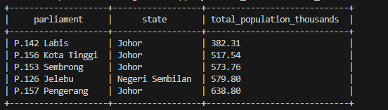

# Lab Test Report

This document provides a comprehensive guide to setting up and using Apache Hive for data warehousing tasks, including installation, configuration, and basic operations. The report is written in Markdown and formatted to Words by `Pandoc`. All the codes are available in my [GitHub repository](https://github.com/keanteng/wqd7007-lab-test).

## Configuration

Hive is accessed through docker container by pulling the official image from Docker Hub. The container is pulled, activated and accessed with the following commands. Note that docker volume is also created to bin the current working directory to the container as `keanteng`, allowing you to access files directly from your host machine:

```bash
# pull the latest Hive image
docker pull apache/hive:4.0.1

# run the Hive container
docker run -d -p 10000:10000 -p 10002:10002 `
  --env SERVICE_NAME=hiveserver2 `
  --name hive-server `
  -v "${PWD}:/keanteng" `
  apache/hive:4.0.1
```

Let's see the terminal output in the image below:


Now let's access the container through the terminal to start working with Hive:

```bash
# access the terminal 
docker exec -it hive-server bash

# find your data, you will be put at opt/hive, to go to root
cd ..
cd ..

# view your directory
ls keanteng

# start hive CLI
hive

# set the connection
!connect jdbc:hive2://localhost:10000
```

## Question 1

Download one set of data (in .csv) about parliamentary constituencies population. Please refer to Appendix 1 (at the end of the document) on which dataset you should download. Import the downloaded dataset to HDFS. Clean the data whenever necessary. 

## Answer

I will download the `Set09.xlsx`. I need to convert it to CSV format so that it can be used.

The data is already is HDFS:


Now let's work with the data with Hive where we clean it and preprocess it.

```bash
-- First, drop the existing table
DROP TABLE IF EXISTS raw_parliamentary_data;

-- Method 1: Create table without LOCATION and use LOAD DATA
CREATE TABLE IF NOT EXISTS raw_parliamentary_data (
    date_str STRING,
    state STRING,
    parliament STRING,
    gender STRING,
    population_str STRING
)
ROW FORMAT DELIMITED
FIELDS TERMINATED BY ','
STORED AS TEXTFILE
TBLPROPERTIES ('skip.header.line.count'='1');

-- Load data from your CSV file
LOAD DATA LOCAL INPATH '/keanteng/data/Set09.csv' INTO TABLE raw_parliamentary_data;
```

Create cleaned table with proper data types and constraints:

```bash
-- Drop the existing table first
DROP TABLE IF EXISTS parliamentary_constituencies;

-- Then create the cleaned table with proper data types
CREATE TABLE parliamentary_constituencies (
    record_date DATE,
    state STRING,
    parliament STRING,
    gender STRING,
    population_thousands DECIMAL(10,2)
)
STORED AS PARQUET;
```

Clean and insert data into the cleaned table:

```bash
-- Clean and insert data into the final table
INSERT INTO parliamentary_constituencies
SELECT 
    FROM_UNIXTIME(UNIX_TIMESTAMP(date_str, 'yyyy/MM/dd'), 'yyyy-MM-dd') as record_date,
    TRIM(state) as state,
    TRIM(parliament) as parliament,
    TRIM(LOWER(gender)) as gender,
    CAST(REGEXP_REPLACE(population_str, '[^0-9.]', '') AS DECIMAL(10,2)) as population_thousands
FROM raw_parliamentary_data
WHERE date_str IS NOT NULL 
    AND date_str != ''
    AND state IS NOT NULL 
    AND state != ''
    AND parliament IS NOT NULL 
    AND parliament != ''
    AND population_str IS NOT NULL 
    AND population_str != '';
```

Verify the data in the cleaned table:

```bash
-- Check the cleaned data
SELECT * FROM parliamentary_constituencies LIMIT 10;

-- Get basic statistics
SELECT 
    COUNT(*) as total_records,
    COUNT(DISTINCT state) as unique_states,
    COUNT(DISTINCT parliament) as unique_constituencies,
    MIN(population_thousands) as min_population,
    MAX(population_thousands) as max_population,
    AVG(population_thousands) as avg_population
FROM parliamentary_constituencies;
```
This is the output of the cleaned data:


## Question 2

### Part A

The state that has the highest population. 

### Answer

```bash
-- Find the state with the highest total population
SELECT 
    state,
    SUM(population_thousands) as total_population_thousands
FROM parliamentary_constituencies
GROUP BY state
ORDER BY total_population_thousands DESC
LIMIT 1;
```


### Part B

The year with the highest population. 

### Answer

```bash
-- Find the year with the highest total population
SELECT 
    YEAR(record_date) as year,
    SUM(population_thousands) as total_population_thousands
FROM parliamentary_constituencies
GROUP BY YEAR(record_date)
ORDER BY total_population_thousands DESC
LIMIT 1;
```


### Part C

5 parliament constituencies constituencies provided that have the lowest population among all

### Answer

```bash
SELECT 
    parliament,
    state,
    SUM(population_thousands) as total_population_thousands
FROM parliamentary_constituencies
GROUP BY parliament, state
ORDER BY total_population_thousands ASC
LIMIT 5;
```



### Part D

The parliament constituencies that have the highest contrast between genders

### Answer

```bash
-- Find parliamentary constituencies with the highest gender contrast (absolute difference)
SELECT 
    parliament,
    state,
    SUM(CASE WHEN gender = 'male' THEN population_thousands ELSE 0 END) as male_population,
    SUM(CASE WHEN gender = 'female' THEN population_thousands ELSE 0 END) as female_population,
    SUM(population_thousands) as total_population,
    ABS(SUM(CASE WHEN gender = 'male' THEN population_thousands ELSE 0 END) - 
        SUM(CASE WHEN gender = 'female' THEN population_thousands ELSE 0 END)) as gender_contrast,
    ROUND(
        (ABS(SUM(CASE WHEN gender = 'male' THEN population_thousands ELSE 0 END) - 
             SUM(CASE WHEN gender = 'female' THEN population_thousands ELSE 0 END)) / 
         SUM(population_thousands)) * 100, 2
    ) as contrast_percentage
FROM parliamentary_constituencies
GROUP BY parliament, state
HAVING SUM(CASE WHEN gender = 'male' THEN population_thousands ELSE 0 END) > 0 
   AND SUM(CASE WHEN gender = 'female' THEN population_thousands ELSE 0 END) > 0
ORDER BY gender_contrast DESC
LIMIT 10;
```


## Part 2

### Question 1

Import text from the specified web link in Appendix 1 to HDFS (click the link). Please  make sure you follow the instructions carefully. 
https://www.gutenberg.org/cache/epub/31284/pg31284.txt

Since our windows is bine with Docker we can use Powershell to load it:

```bash
# Use PowerShell to download the file
powershell -Command "Invoke-WebRequest -Uri 'https://www.gutenberg.org/cache/epub/31284/pg31284.txt' -OutFile 'data/gutenberg_text.txt'"
```

We can see the file is in the directory now:


### Question 2

Run a word count program using Hadoop MapReduce concept to count the word occurrence of the imported texts as in step 1. Save the results in HDFS.

### Answer

First create an input folder and put the targeted file there:

```bash
hdfs dfs -ls /keanteng/data
hdfs dfs -put /keanteng/data/gutenberg_text.txt /keanteng/data/input
hdfs dfs -ls /keanteng/data/input
```


Now run the MapReduce job to count the words:

```bash
hadoop jar $HADOOP_HOME/share/hadoop/mapreduce/hadoop-mapreduce-examples-*.jar wordcount /keanteng/data/input keanteng/data/output
```

We can see the job is success:


We can see the output:


## Question 3

Import the result from step 2 to Apache Hive. Display: 
- 5 words with 5 counts in ascending alphabetical order. 
- 10 words with lowest counts in descending alphabetical order.

### Answer

```bash
-- Create table for word count results
CREATE TABLE IF NOT EXISTS word_counts (
    word STRING,
    count INT
)
ROW FORMAT DELIMITED
FIELDS TERMINATED BY '\t'
STORED AS TEXTFILE;

-- Load data from HDFS MapReduce output
LOAD DATA INPATH '/keanteng/data/keanteng/data/output/part-r-00000' INTO TABLE word_counts;
```

Now let's display the results as requested:

```bash 
-- Find 5 words that appear exactly 5 times, ordered alphabetically
SELECT word, count
FROM word_counts
WHERE count = 5
ORDER BY word ASC
LIMIT 5;
```


Now for the 10 words with the lowest counts in descending order:

```bash
-- Find 10 words with the lowest counts, ordered alphabetically descending
SELECT word, count
FROM word_counts
ORDER BY count ASC, word DESC
LIMIT 10;
```

This is the output:


### Question 4

Clean the text imported in Question 1. Then, repeat the steps in Question 2 and 3. Compare both sets of results. 

Do the cleaning:

```bash
# Step 1: Clean the text file using sed/awk commands
# Remove Project Gutenberg header/footer, convert to lowercase, remove punctuation
sed -n '/START OF THE PROJECT GUTENBERG EBOOK/,/END OF THE PROJECT GUTENBERG EBOOK/p' /keanteng/data/gutenberg_text.txt | \
sed '1d;$d' | \
tr '[:upper:]' '[:lower:]' | \
sed 's/[^a-z ]//g' | \
sed 's/  */ /g' > /keanteng/data/gutenberg_cleaned.txt
```


Now we can repeat the steps in Question 2 and 3:

```bash
hdfs dfs -put /keanteng/data/gutenberg_cleaned.txt /keanteng/data/input2
hdfs dfs -ls /keanteng/data/input2
```


Now run the MapReduce job again:

```bash
hadoop jar $HADOOP_HOME/share/hadoop/mapreduce/hadoop-mapreduce-examples-*.jar wordcount /keanteng/data/input2 keanteng/data/output2
```


Now we can load the results into Hive:

```bash
-- Drop the table if it exists first
DROP TABLE IF EXISTS cleaned_word_counts;

-- Create table for cleaned word count results
CREATE TABLE IF NOT EXISTS cleaned_word_counts (
    word STRING,
    count INT
)
ROW FORMAT DELIMITED
FIELDS TERMINATED BY '\t'
STORED AS TEXTFILE;

-- Load data from HDFS MapReduce output for cleaned text
LOAD DATA INPATH '/keanteng/data/keanteng/data/output2/part-r-00000' INTO TABLE cleaned_word_counts;
```

Now let's display the results as requested:

```bash
-- Find 5 words that appear exactly 5 times, ordered alphabetically
SELECT word, count
FROM cleaned_word_counts
WHERE count = 5
ORDER BY word ASC
LIMIT 5;
```


Now for the 10 words with the lowest counts in descending order:

```bash
-- Find 10 words with the lowest counts, ordered alphabetically descending
SELECT word, count
FROM cleaned_word_counts
ORDER BY count ASC, word DESC
LIMIT 10;
```


# Comparing Results:

## Analysis of MapReduce Word Count Results: Cleaned vs. Uncleaned Text Data

The sets of images showcase the output of Hadoop MapReduce jobs designed to perform word count operations on two distinct versions of a text corpus: an uncleaned version and a version where punctuation has been largely removed (cleaned). This comparison highlights the critical impact of text pre-processing on the quality and interpretability of word frequency analysis.

**Observations from Uncleaned Data (Images 1 & 3):**

The results from the uncleaned dataset demonstrate several characteristic features:

1.  **Inclusion of Punctuation:** Words are frequently accompanied by punctuation marks, such as quotation marks (`“Right`, `“Information`, `“Defects,”`, `‘AS-IS’,`), commas (`übten,`, `übte,`), and periods (`übte.`).
2.  **Inflated Unique Word Count:** Each unique combination of a word and its adjacent punctuation is treated as a distinct token. For instance, "übte," "übte.", and "übte" (if it appeared without punctuation) would be counted as separate entities.
3.  **Lower Individual Frequencies:** Consequently, the counts for what might semantically be the same word are fragmented across its various punctuated forms. Many words in the provided snippets (e.g., "zwlften," "zwlfmalen," "“Right") appear with a count of '1'. This suggests a long-tail distribution where many "words" are unique due to punctuation variations.
4.  **Query Execution Time:** The execution times for these uncleaned queries were observed to be approximately 1.304 seconds (Image 1) and 1.285 seconds (Image 3).

**Observations from Cleaned Data (Images 2 & 4):**

The results from the dataset subjected to punctuation removal present a contrasting picture:

1.  **Absence of Most Punctuation:** The majority of words appear without leading or trailing punctuation (e.g., "a", "abwechselnd", "alter", "ans", "apparat"). This indicates a successful pre-processing step aimed at normalizing the text.
2.  **Consolidated Word Counts:** Words that would have been distinct in the uncleaned version due to punctuation are now aggregated. For example, if "apparat," "apparat.", and "apparat" existed in the original text, they would all contribute to the count of the single token "apparat" in the cleaned version. This is reflected in higher counts for common words (e.g., '5' for "a", "abwechselnd", "apparat").
3.  **Anomalies and Potential Imperfections in Cleaning:**
    *   Image 4 shows "Alois," still retaining a comma. This suggests that the cleaning process might not be exhaustive (e.g., it might miss certain trailing punctuation types or internal punctuation).
    *   Image 4 also lists `*` with a count of 5. The presence of an asterisk as a "word" is unusual and could indicate either that the asterisk itself was present as a token in the source text and not removed, or it's an artifact of the cleaning process (e.g., replacing certain characters).
4.  **MapReduce Job Structure:** Image 2 explicitly shows the completion of Map and Reduce phases ("Map 1 ... SUCCEEDED", "Reducer 2 ... SUCCEEDED"), confirming the underlying distributed processing paradigm.
5.  **Query Execution Time:** The execution times for these cleaned queries were observed to be approximately 3.428 seconds (Image 2) and 4.692 seconds (Image 4).

**Comparative Analysis and Discussion:**

The primary distinction lies in the **granularity and semantic accuracy** of the word counts.

*   **Semantic Meaning:** The cleaned data provides a more semantically meaningful representation of word frequencies. For most analytical purposes (e.g., identifying common themes, building language models), "word," and "word." are instances of "word." The cleaned output reflects this.
*   **Vocabulary Size:** The uncleaned data will invariably produce a significantly larger vocabulary of unique "words," many of which are artificial distinctions caused by punctuation. This can complicate further analysis and obscure true word frequencies.
*   **Frequency Distribution:** The cleaned data is likely to exhibit a more standard Zipfian distribution of word frequencies, where a few words are very common, and many are rare. The uncleaned data skews this by over-representing rare, punctuation-laden tokens.
*   **Computational Considerations:** The cleaned data queries took slightly longer (e.g., 3.4-4.7 seconds vs. 1.3 seconds). This increased time can be attributed to several factors:
    *   The pre-processing step (cleaning) itself, if performed within the MapReduce job or as an initial pass, adds computational overhead.
    *   With fewer unique keys (words) after cleaning, reducers might handle larger lists of values to aggregate for each key, potentially increasing reduce-side processing time, although this can also lead to better data locality and fewer intermediate spills if managed well.

The anomaly of "Alois," and `*` in the "cleaned" output (Image 4) is noteworthy. It underscores that text cleaning is often an iterative process and may require refinement of rules (e.g., regular expressions) to handle all edge cases and achieve the desired level of normalization. The `*` token, in particular, warrants investigation into its origin within the dataset or the cleaning logic.

**Conclusion:**

This comparison demonstrates the profound impact of text pre-processing on the outcomes of MapReduce-based word count tasks. While the uncleaned data provides a raw tokenization, the cleaned data offers a more accurate and analytically useful representation of word frequencies by normalizing textual variations introduced by punctuation. The choice of processing depends on the analytical goal; however, for most standard natural language processing tasks, a cleaned dataset is preferable, despite the potential for slight increases in initial processing time and the need for careful implementation of cleaning routines to avoid introducing artifacts or missing certain punctuation cases.